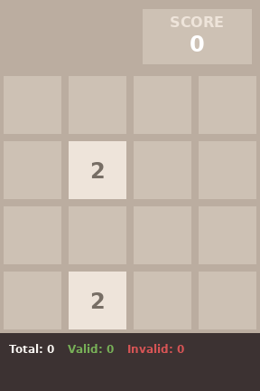
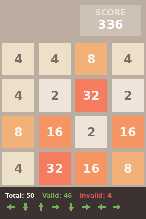
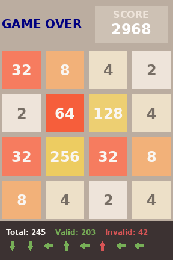

# gym_2048

A simple Gymnasium environment for the game 2048.

## Description

This environment implements the classic 2048 game. The game is played on a 4x4 grid. The goal is to slide tiles on the grid to combine tiles of the same value and create a tile with the value 2048.

## Installation

To install the environment, you can use pip:

```bash
pip install gym_2048
```

## Usage

To use the environment, you can use the following code:

```python
import gymnasium as gym
import gym_2048

env = gym.make('2048-v0')

observation, info = env.reset()
done = False

while not done:
    action = env.action_space.sample()  # your agent here (this takes random actions)
    observation, reward, terminated, truncated, info = env.step(action)
    done = terminated or truncated

env.close()
```

## Action Space

The action space is a `Discrete(4)` space, where the actions are:

*   `0`: Up
*   `1`: Down
*   `2`: Left
*   `3`: Right

## Observation Space

The observation space is a `Dict` with two keys:

*   `'observation'`: A `Box` of shape `(4, 4)` representing the integer values of the game board.
*   `'valid_mask'`: A `Box` of shape `(4,)` representing a binary mask of valid actions.

## Rewards

The reward is the sum of the values of the merged tiles in a step. If an invalid move is made, the reward is -32.

## Screenshots

### Initial State



### Mid-game State



### Game Over State

